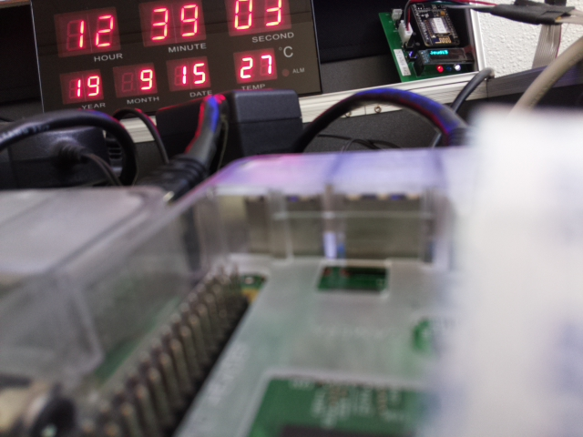
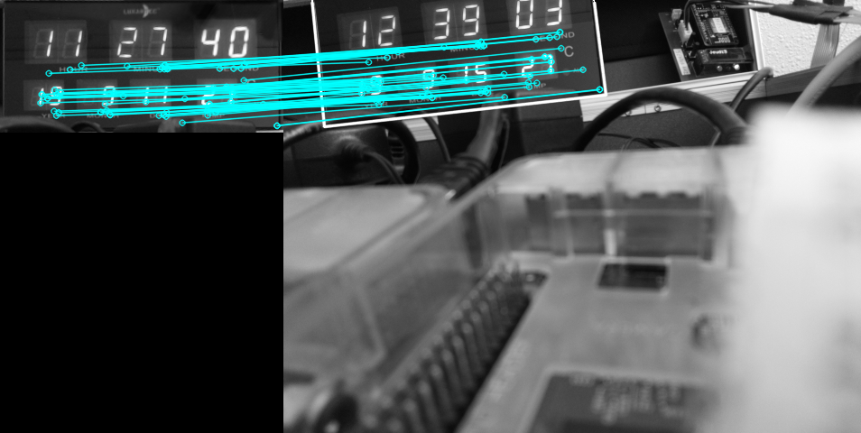
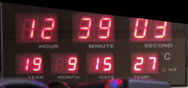
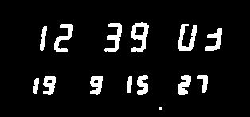
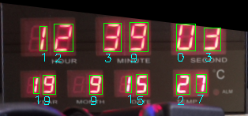

*made in 09/2019*

# Machine-learning-OCR

Machine learning Optical Character Recognition (OCR) project. Read the time on a digital clock but inputting an image.

- [Machine-learning-OCR](#machine-learning-ocr)
- [The process](#the-process)
  - [Step 0 : The input image](#step-0--the-input-image)
  - [Step 1 : Homographic transformation](#step-1--homographic-transformation)
  - [Step 2 : Output from the homography](#step-2--output-from-the-homography)
  - [Step 3 : Masking the image](#step-3--masking-the-image)
  - [Step 4 : Process of analysis](#step-4--process-of-analysis)
- [The trainning process](#the-trainning-process)

# The process

## Step 0 : The input image

We want to extract the time from an image.

## Step 1 : Homographic transformation

Look for the similarity between the reference image and the input image. The goal here is to revert the effect of perspective distortion in order to get a flat image and getting rid of the useless parts of the image.

## Step 2 : Output from the homography

If the homography is a success then the image is wrapped and transformed according to the reference homography else the image is the input image.

## Step 3 : Masking the image

We create a binary image from the previous image according to a color threshold

## Step 4 : Process of analysis

We extract each element of the binary image, then the trained model compare these shapes with a bank of images of digits. Then the algorithm returns the corresponding digit.

# The trainning process

To train ou model we have a bank of images of digits sorted and labeled. We can then use a classification algorithm to train the model.